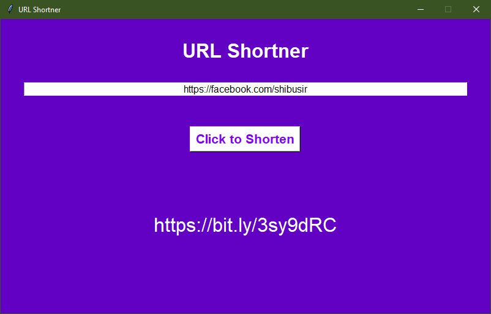

# TK - URL Shortner

A simple URL Shortner Desktop App using Python, Tkinter & Pygubu

## Usage
1. Generate a generic token from [Bitly](https://bitly.com)
2. Update the token in the source code
3. Install the requests package `pip install requests`
4. Run program `python urlshortner.py`

## Screenshot
